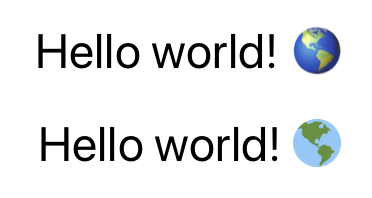

# 😁 react-native-twemojis 📦

[](https://www.npmjs.com/package/react-native-twemojis)


Replace emojis with Twemojis in your next React Native app.

## 📥 Installation

`npm install react-native-twemojis`

or

`yarn add react-native-twemojis`

## 👀 Demo

At the top there is `Text` component rendered on iOS device, and at the bottom there is rendered `TwemojiText` component.



## 🧰 Usage

The `TwemojiText` component behaves just like `Text` component, but replaces all the emojis with their Twemoji equivalent.

```
import TwemojiText from 'react-native-twemojis';

const Component = () => {
    return (
        <TwemojiText>
            Hello world! 🌎
        </TwemojiText>
    );
}
```

## 🎚 Props

The `TwemojiText` component accepts all `Text` props by default.

### twemojiStyle

*Required*: no, *Default*: empty

If you want to customize the styling of the Twemojis

### base

*Required*: no, *Default*: `https://twemoji.maxcdn.com/2/72x72/`

Dfeault source for image to be taken from.
Either can be `string`, then source will be `${base}${emojiName}.png`,
or function `(emojiName: string) => string`, then result of the function is taken